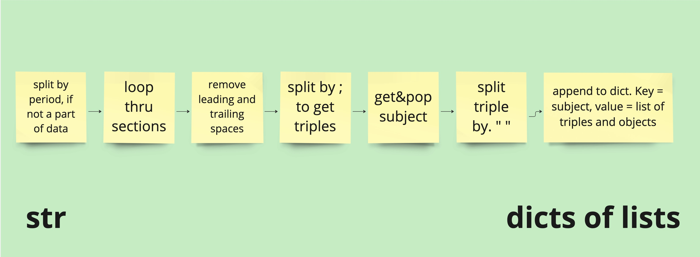
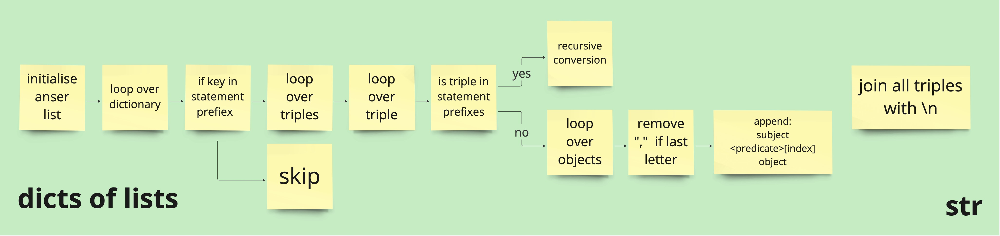
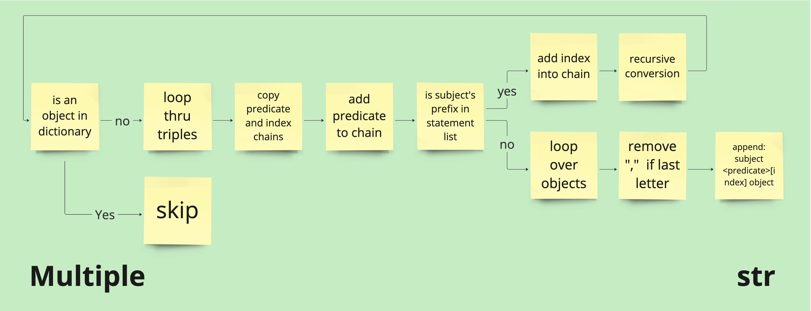

# TTL to New Format Converter
(text is generated by GPT Model)

This project provides a FastAPI-based web service that converts TTL (Turtle) format to a new, simplified format. The service accepts TTL files, processes them, and returns the converted data in a text file.

## Features

- FastAPI-based web service
- TTL to new format conversion
- File upload and download functionality
- Logging and error handling
- Health check endpoint

## Requirements

- Python 3.7+
- FastAPI
- Uvicorn
- Python-multipart
- Pydantic

## Installation

1. Clone this repository:
   ```
   git clone https://github.com/Koveh/ttl-converter.git
   cd ttl-converter
   ```

2. Install the required packages:
   ```
   pip install -r requirements.txt
   ```

## Usage

1. Start the FastAPI server:
   ```
   uvicorn ttl_converter_ftp_api:app --host 0.0.0.0 --port 8000
   ```

2. The API will be available at `http://localhost:8000`

3. Use the `/convert` endpoint to upload a TTL file and receive the converted format:
   - Send a POST request to `http://localhost:8000/convert` with the TTL file in the request body.
   - The converted file will be returned as a downloadable response.

4. Use the `/health` endpoint to check the status of the service:
   - Send a GET request to `http://localhost:8000/health`

## Algorithm Explanation

The TTL to new format conversion process consists of several steps, as illustrated in the following diagrams:

### 1. Preprocessing


This step takes the TTL file as a string input and performs the following operations:
- Removes line breaks and excess spaces
- Ensures space after semicolons and commas
- Removes space before periods at the end of statements

### 2. Splitting into Sections



The preprocessed string is split into sections:
- Split by period, avoiding splits within data types or URLs
- For each section, extract the subject and associated statements
- Split each statement into parts (predicate and objects)
- Create a dictionary where keys are subjects and values are lists of statement parts

### 3. Conversion to New Format



The main conversion process:
- Initialize an answer list
- Loop over the dictionary of sections
- For each subject and its triples:
  - If the predicate is in the statement prefix list, perform recursive conversion
  - Otherwise, format the triple into the new format and append to the answer list
- Join all converted triples with newline characters

### 4. Recursive Conversion



For nested statements:
- Check if the object is a reference to another statement
- If so, process that statement recursively
- Build chains of predicates and indexes to represent the nesting
- Format the final triple and append to the answer list

The result of this process is a string containing all the converted triples in the new format.

## API Endpoints

- `POST /convert`: Convert a TTL file to the new format
- `GET /health`: Check the health status of the service

## Logging

Logs are stored in a `log.txt` file in the same directory as the script. The log file uses a rotating file handler with a maximum size of 10,000 bytes and keeps one backup.

## Error Handling

The service includes error handling for various scenarios, including invalid TTL format and conversion failures. Detailed error messages are logged and returned in the API response.

## Performance

The conversion process includes timing information. The execution time for each conversion is logged and returned in the response headers as `X-Execution-Time`.

## Contributing

Contributions are welcome! Please feel free to submit a Pull Request.

## License

This project is licensed under the MIT License.
